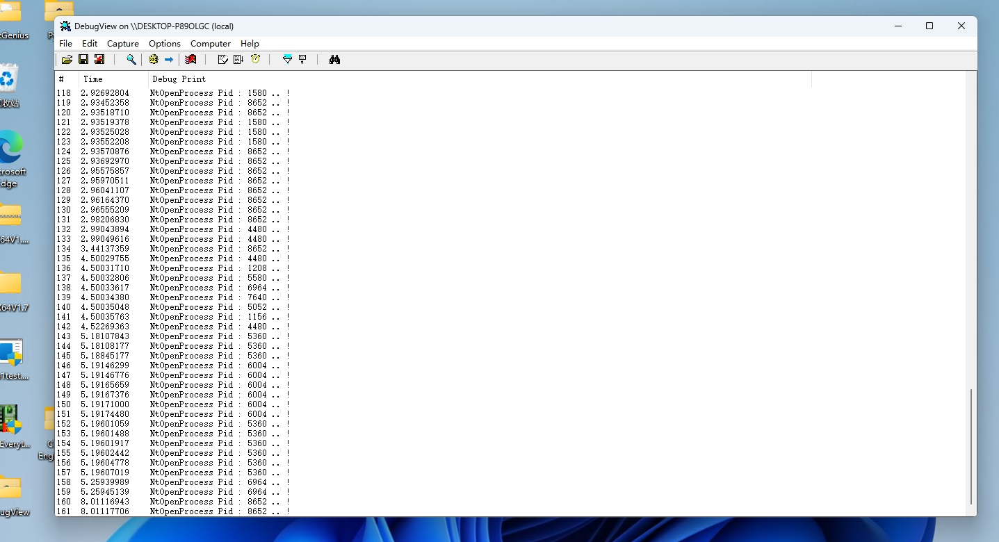
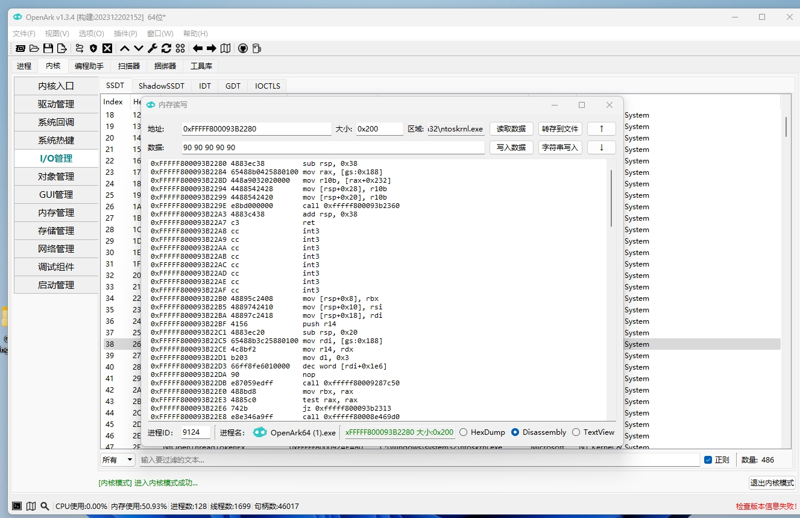
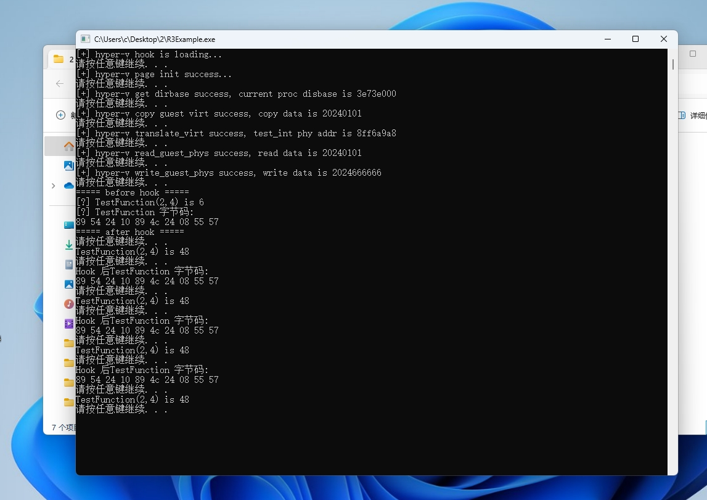

# Voyager-Next
> 一个 hyper-v 劫持框架
***
#### 已实现（抄袭）：
- r0/r3 Ept Hook
- 读写任意物理内存
- 启动时修改 smbios
- 修改启动图标和文字
- 其它功能和代码还待完善........
***
*仅适配了Win11 23H2,其它系统后续添加测试*


#### 抄袭项目
[VoyagerWithEPT](https://github.com/samshine/VoyagerWithEPT)

[busybox提供](https://www.unknowncheats.me/forum/anti-cheat-bypass/617649-hyperv-shitpaste.html) 可能是Fecurity Loader的源码？

#### 截图

hook NtOpenProcess 查看反汇编未发现jmp

r3 测试功能


#### 测试方法
```
确保系统适配的情况下 运行Loader.exe  
参数p指定到需要map的sys文件全路径
其它参数看Loader.cpp

hyper-v 中串口输出方法：
vmware配置串口输出到文件
虚拟机中设置串口服务启动方式未禁用
debug.h 中指定你的串口号

```